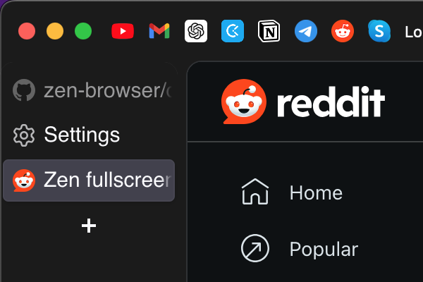
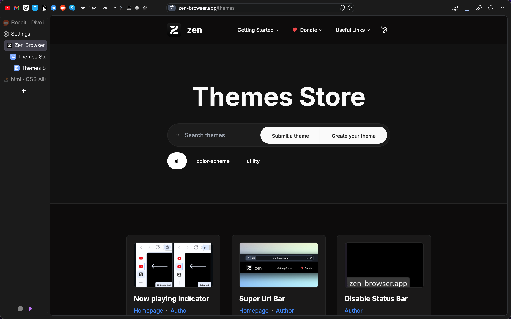

# Zen-Sidebery

## Hide native Zen tab panel to use Sidebery

### What you can enable

* Hide Sidebar Header

### Instructions:

1. Install the theme
2. Install [Sidebery addon](https://addons.mozilla.org/en-US/firefox/addon/sidebery/)

### You can upload custom Sidebery settings:

1. Download sidebery.json from this repo
2. Go to Sidebery Settings -> Help -> Import Addon Data
3. Select downloaded file

### or customize it the way you want

### In case you want to thank me: https://www.buymeacoffee.com/alex_coder